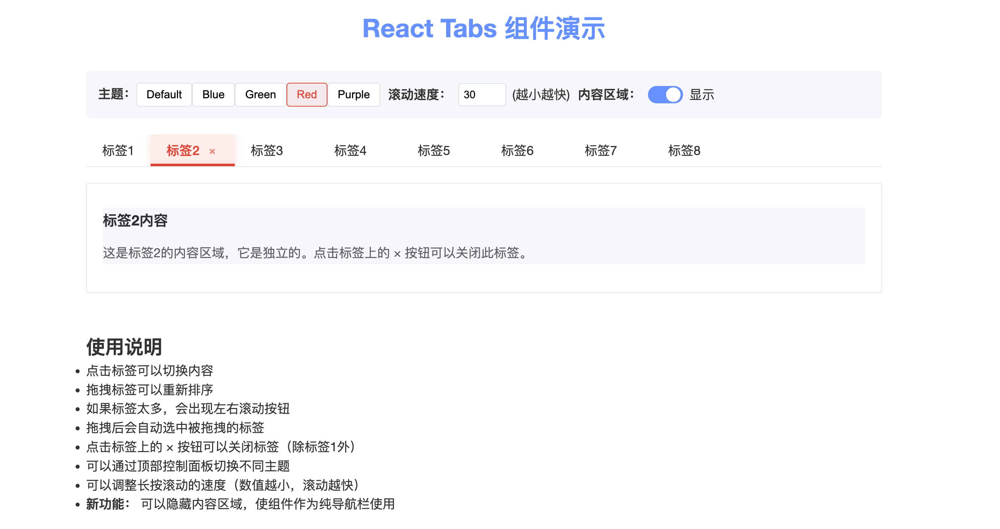

# React Tabs 组件

一个功能丰富、高度可定制的 React 标签页组件，模仿 ElementUI 的设计风格，提供丰富的交互体验和美观的 UI 效果。

[](https://github.com/Duanhsbs88/ReactTabs.git)
[](LICENSE)

## 效果展示

下图展示了组件的实际运行效果，包括主题切换、标签关闭、内容区域控制等功能：



*图中展示了组件的多种功能：主题切换、可关闭标签、内容区域显示/隐藏控制、速度调整等*

## 特性

- ✨ **标签页基本功能**：支持多标签切换、内容展示
- 🔄 **拖拽排序**：标签可以通过拖拽重新排序
- 📜 **横向滚动**：标签过多时自动显示左右滚动按钮
- 🖱️ **长按滚动**：支持长按滚动按钮实现连续滚动
- 🧲 **智能边缘滚动**：拖拽标签到容器边缘时自动滚动
- ❌ **标签关闭功能**：可配置标签的可关闭性，单独或全局控制
- 🎨 **主题定制**：支持完全自定义主题色系，可动态切换
- 🚀 **导航栏模式**：可将组件作为纯导航栏使用，隐藏内容区域
- ⚡ **样式隔离**：所有样式都有唯一前缀，避免样式冲突

## 安装

使用 npm:

```bash
npm install react-tabs --save
```

或者使用 yarn:

```bash
yarn add react-tabs
```

也可以直接从GitHub克隆代码:

```bash
git clone https://github.com/Duanhsbs88/ReactTabs.git
```

## 基本用法

```jsx
import React from 'react';
import { Tabs } from 'react-tabs';
import 'react-tabs/dist/styles.css';

function App() {
  const handleChange = (key) => {
    console.log(`Active tab: ${key}`);
  };

  return (
    <Tabs defaultActiveKey="1" onChange={handleChange}>
      <Tabs.TabPane key="1" tab="标签1">
        <div>标签1的内容</div>
      </Tabs.TabPane>
      <Tabs.TabPane key="2" tab="标签2">
        <div>标签2的内容</div>
      </Tabs.TabPane>
      <Tabs.TabPane key="3" tab="标签3">
        <div>标签3的内容</div>
      </Tabs.TabPane>
    </Tabs>
  );
}

export default App;
```

## 高级用法

### 可关闭标签

```jsx
<Tabs 
  defaultActiveKey="1" 
  closable={true} 
  onClose={(key, remainingTabs) => console.log(`Tab ${key} closed`)}
>
  <Tabs.TabPane key="1" tab="标签1" closable={false}>
    <div>此标签不可关闭</div>
  </Tabs.TabPane>
  <Tabs.TabPane key="2" tab="标签2">
    <div>此标签可关闭</div>
  </Tabs.TabPane>
</Tabs>
```

### 拖拽排序

默认支持拖拽排序，可以监听排序事件：

```jsx
<Tabs 
  defaultActiveKey="1" 
  onReorder={(newOrder) => console.log('New order:', newOrder)}
>
  {/* TabPane 内容 */}
</Tabs>
```

### 自定义主题

```jsx
<Tabs
  theme={{
    'primary-color': '#1890ff',    // 主色调
    'primary-light': 'rgba(24, 144, 255, 0.1)', // 淡色背景
    'text-color': '#333333',       // 文字颜色
    'text-light': '#606266',       // 浅色文字
    'text-lighter': '#909399',     // 更浅色文字
    'border-color': '#e4e7ed',     // 边框颜色
    'bg-color': '#fff',            // 背景色
    'bg-light': '#f5f7fa',         // 浅色背景
    'shadow-color': 'rgba(0, 0, 0, 0.05)', // 阴影颜色
    'danger-color': '#f56c6c',     // 危险色（关闭按钮）
    'disabled-color': '#c0c4cc'    // 禁用颜色
  }}
>
  {/* TabPane 内容 */}
</Tabs>
```

### 导航栏模式

```jsx
<Tabs 
  showContent={false} 
  defaultActiveKey="1"
  onChange={(key) => console.log(`Navigate to: ${key}`)}
>
  <Tabs.TabPane key="1" tab="首页" />
  <Tabs.TabPane key="2" tab="产品" />
  <Tabs.TabPane key="3" tab="服务" />
  <Tabs.TabPane key="4" tab="关于我们" />
</Tabs>
```

### 控制滚动速度

```jsx
<Tabs scrollSpeed={15}>  {/* 数值越小滚动越快 */}
  {/* TabPane 内容 */}
</Tabs>
```

## API

### Tabs

| 属性 | 类型 | 默认值 | 说明 |
| --- | --- | --- | --- |
| children | ReactNode | - | 子元素，应为 Tabs.TabPane |
| defaultActiveKey | string | 第一个标签的key | 默认激活的标签页 |
| onChange | (key: string) => void | - | 切换标签时的回调 |
| onReorder | (newOrder: Array) => void | - | 标签排序变化时的回调 |
| onClose | (key: string, remainingTabs: Array) => void | - | 关闭标签时的回调 |
| closable | boolean | false | 是否所有标签都可关闭 |
| scrollSpeed | number | 25 | 滚动速度，值越小滚动越快 |
| theme | object | - | 自定义主题配置 |
| showContent | boolean | true | 是否显示内容区域 |

### Tabs.TabPane

| 属性 | 类型 | 默认值 | 说明 |
| --- | --- | --- | --- |
| key | string | - | 唯一标识 |
| tab | ReactNode | - | 标签页显示的标题 |
| children | ReactNode | - | 标签页内容 |
| closable | boolean | - | 标签页是否可关闭，会覆盖 Tabs 的全局设置 |

## 浏览器兼容性

- 支持所有现代浏览器（Chrome, Firefox, Safari, Edge）
- IE 11+ 需要额外的 polyfills

## 本地开发

```bash
# 克隆仓库
git clone https://github.com/Duanhsbs88/ReactTabs.git

# 进入项目目录
cd ReactTabs

# 安装依赖
npm install

# 启动开发服务器
npm start
```

## 贡献

欢迎提交 Issues 和 Pull Requests 来完善此组件！

1. Fork [仓库](https://github.com/Duanhsbs88/ReactTabs.git)
2. 创建特性分支 (`git checkout -b feature/amazing-feature`)
3. 提交更改 (`git commit -m 'Add some amazing feature'`)
4. 推送到分支 (`git push origin feature/amazing-feature`)
5. 开启 Pull Request

## 版本控制

项目已配置标准的 `.gitignore` 文件，以排除不应纳入版本控制的文件：

- 依赖目录 (`node_modules`)
- 构建输出 (`build`, `dist`)
- 环境变量文件 (`.env*`)
- 编辑器配置和缓存文件
- 日志文件

请确保不要提交这些被忽略的文件。

## 许可证

[MIT](LICENSE)
